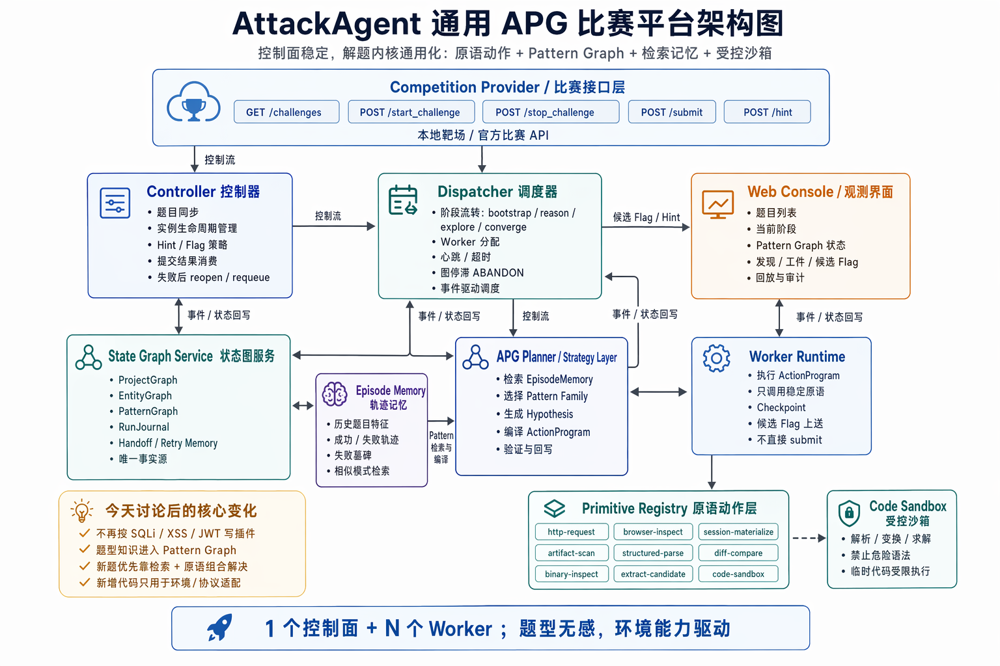

# Architecture

## Shared Diagram

## Core Reading Order

Start from these layers when resuming work:

1. `attack_agent/platform.py`
2. `attack_agent/controller.py`
3. `attack_agent/dispatcher.py`
4. `attack_agent/state_graph.py`
5. `attack_agent/apg.py`
6. `attack_agent/runtime.py`
7. `attack_agent/strategy.py`

## Design Summary

Current status:

- the platform path is the only canonical product path
- the first-stage minimal real primitive loop is closed
- the legacy single-agent entry path is being decommissioned

Control plane:

- `CompetitionProvider`: wraps official or local challenge APIs
- `Controller`: challenge sync, lifecycle, hint policy, submit policy
- `Dispatcher`: worker assignment, stage flow, timeout, requeue, abandon

Solving core:

- `APGPlanner`: selects pattern families and compiles `ActionProgram`
- `Primitive Runtime`: executes stable primitive actions instead of challenge-type plugins
- `CodeSandbox`: runs restricted temporary code for parsing, transform, and solving support
- `EpisodeMemory`: retrieves similar prior episodes to improve planning

State plane:

- `StateGraphService`: single source of truth for project state, observations, artifacts, hypotheses, candidate flags, run journal, handoff, and pattern graph status

Observation plane:

- `Web Console`: read-only summary of stage, family, flags, and project state

Current primitive status:

- `http-request`: minimal real branch closed
- `browser-inspect`: minimal real branch closed
- `binary-inspect`: minimal real branch closed
- `artifact-scan`: minimal real branch closed

These remain intentionally narrow slices with metadata fallback preserved.

## Why This Matters

The key architectural shift from today is:

- no longer writing one plugin per challenge type
- storing challenge knowledge in `PatternGraph`
- solving new challenges through retrieval plus primitive composition
- reserving new code mainly for environment or protocol adapters
