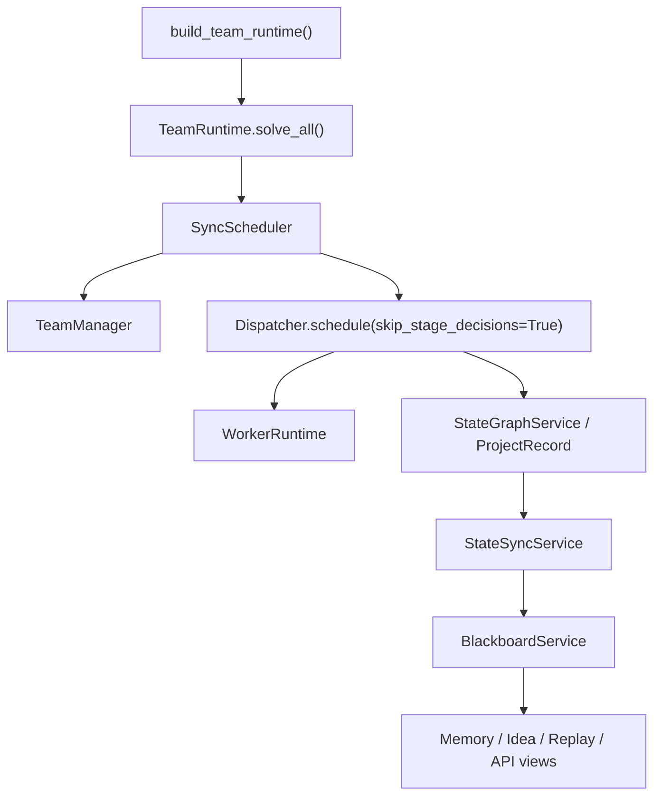
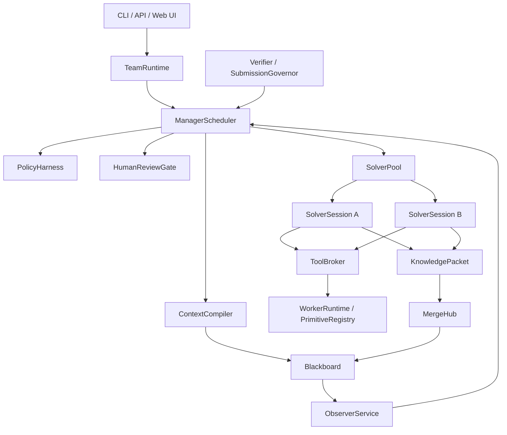

# AttackAgent Architecture

Last updated: 2026-05-14

This document is the current architecture authority. L1-L10 platform components now exist, but the real solve path still has L11 stabilization work before the architecture can be called complete.

## 1. Product Direction

AttackAgent is evolving from a compact single-runtime CTF solver into a team-style solving platform:

```text
Manager        schedules, budgets, reviews, and decides
Solver         explores one assigned direction over a long-lived session
Observer       detects loops, drift, low novelty, and unsafe behavior
Verifier       checks candidate flags and critical conclusions
Human Analyst  approves high-risk or ambiguous actions
Blackboard     stores shared facts, ideas, evidence, memory, and events
MergeHub       deduplicates, arbitrates, and routes shared intelligence
PolicyHarness  enforces scope, risk, budget, and review boundaries
ToolBroker     mediates tool execution
```

The final product should expose both:

```text
CLI/API        automation, tests, batch runs
Web UI/GUI     live operation, review, intervention, replay, and audit
```

## 2. Current Reality

The current implementation is a hybrid:



Important facts:

- `TeamRuntime` is the public entry point.
- `Dispatcher` and `WorkerRuntime` still perform real solve execution.
- `StateGraphService` is still the execution-side state owner.
- `BlackboardService` is durable and queryable, but it is still partly fed by sync from `StateGraphService`.
- `ContextCompiler`, `PolicyHarness`, `HumanReviewGate`, `MergeHub`, `Observer`, and `SolverSessionManager` exist, but several are not yet proven as required participants in the real solve path.
- Multi-Solver collaboration is not complete. Default project solver count is still effectively one.
- Web UI, REST API, and SSE infrastructure exist and build, but runtime semantics still need L11 stabilization.

## 3. Target Boundary

The intended runtime should become:



Final-state invariants:

- Blackboard is the team truth source.
- Manager is the only control plane.
- Manager decisions are recorded as `STRATEGY_ACTION`; worker lifecycle events represent actual worker/session state only.
- Solver sessions are long-lived roles, not isolated one-shot calls.
- Solver sharing uses structured `KnowledgePacket`, not full chat logs.
- Observer reports influence scheduling through Manager and are throttled by meaningful triggers.
- Human review can pause and resume real actions exactly once.
- Policy applies before tool/action execution and after human approval.
- ToolBroker is on the real solve execution path, not only the manual API path.
- Web UI consumes stable API/state events instead of reaching into internals.

## 4. Main Current Gaps

### 4.1 Scheduler Gap

Status: **partially resolved, L11 required**.

`ContextCompiler.compile_manager_context()` is called before Manager decisions, and StrategyActions pass through `PolicyHarness`. However, action journaling still maps some Manager decisions to execution-state events. In particular, `LAUNCH_SOLVER` is recorded as `WORKER_ASSIGNED`, which can materialize a phantom active SolverSession before `SolverSessionManager.create_and_persist()` creates the real one. With `max_project_solvers=1`, this can block the real launch.

Required invariant: Manager decisions must be recorded as `STRATEGY_ACTION`; only `SolverSessionManager` writes `WORKER_ASSIGNED`, `WORKER_HEARTBEAT`, `WORKER_TIMEOUT`, or terminal worker lifecycle events.

### 4.2 Memory Gap

Status: **component complete, real-path verification required**.

`SolverContextPack` carries facts, credentials, endpoints, failure boundaries, recent tool outcomes, budget constraints, scratchpad summary, and recent event IDs. `MemoryReducer` extracts structured memory from tool outcomes. The remaining requirement is to prove the real solve path feeds the next Solver turn from this structured context rather than only from legacy Dispatcher/StateGraph state.

`SolverSession` lifecycle models exist and outcome events include `solver_id`, but SolverSession ownership is not complete until Manager decision events and worker lifecycle events are separated.

### 4.3 Collaboration Gap

Status: **component complete, real collaboration pending**.

`KnowledgePacket` is the formal Solver sharing payload with types such as fact, idea, failure boundary, credential, endpoint, artifact summary, candidate flag, and help request. MergeHub validates, deduplicates, arbitrates, and routes packets. Raw logs remain evidence references, not broadcast content.

This is not yet equivalent to true multi-Solver teamwork until an end-to-end run proves that one Solver publishes a packet, MergeHub routes it, and another Solver consumes it in its next context pack.

### 4.4 Observer Gap

Status: **wired, needs throttling**.

Observer is a scheduling-loop participant and writes `OBSERVER_REPORT` events. `ContextCompiler` reconstructs full ObserverReport data, and `TeamManager.decide_observer_response()` can produce steer/throttle/stop/reassign/review actions. Observer does not directly mutate facts or stop a Solver.

The current loop should not generate an ObserverReport every cycle by default. It should run on triggers such as N new events, repeated failures, low novelty, solver timeout, budget anomaly, or human request.

### 4.5 Review Gap

Status: **partially resolved, L11 required**.

`ReviewRequest` persists the proposed action payload and review decisions are journaled. Two gaps remain:

- Approved `SUBMIT_FLAG` actions can re-enter the normal high-risk review path instead of executing once.
- `MODIFIED` decisions are recorded but are not yet rebuilt into a modified executable action.

Approval must execute the approved action exactly once through an approval-aware path.

### 4.6 Event Semantics Gap

Status: **mostly resolved, with one critical exception**.

`IDEA_PROPOSED/CLAIMED/VERIFIED/FAILED`, `CANDIDATE_FLAG`, `SECURITY_VALIDATION`, and `KNOWLEDGE_PACKET_PUBLISHED/MERGED` are separated. The exception is Manager action recording: `LAUNCH_SOLVER`, `REASSIGN_SOLVER`, and some approved actions still map directly to worker lifecycle events. Manager decisions should be `STRATEGY_ACTION`; worker lifecycle events should represent actual session transitions only.

### 4.7 UI Gap

Status: **L10 component complete**.

React + Tailwind Web UI exists in `web/` and builds with Vite. It is served as static assets by FastAPI when `web/dist/` exists. Core views include Dashboard, Project Workspace, Graph View, Team Board, Idea Board, Memory Board, Observer Panel, Review Queue, Candidate Flag Panel, Artifact Viewer, and Replay Timeline. SSE real-time updates are wired through `useSSE` and `SSEContext`.

Some UI operations remain disabled or semantically pending: freeze/stop/launch Solver profile, mark idea valid/invalid, and direct flag approval outside the review flow.

### 4.8 L11 Runtime Stabilization Findings

The 2026-05-14 review found these real-path issues:

1. **P0 launch/session bug**: `SyncScheduler._record_action()` maps `LAUNCH_SOLVER` to `WORKER_ASSIGNED`, creating phantom active sessions before real session creation.
2. **P0 approved submit loop**: `TeamRuntime._execute_approved_action()` calls `submit_flag()` with the original high risk level, which can create another review instead of submitting.
3. **P1 pause bug**: `SyncScheduler.run_project()` has a separate pause loop before the real scheduling loop; pause delays execution but does not reliably block it.
4. **P1 verification-state mismatch**: `SubmissionVerifier` writes `SECURITY_VALIDATION.payload.idea_id`, while `ContextCompiler` reads `candidate_flag_id`.
5. **P1 ToolBroker path gap**: ToolBroker serves API/request-tool execution, but real solving still goes through `Dispatcher.schedule()` to `WorkerRuntime.run_task()`.
6. **P1 Observer noise**: Observer is called every cycle; it needs trigger/throttle logic to avoid event spam and feedback noise.
7. **P2 audit continuity gap**: `TeamRuntime.solve_all()` clears project Blackboard events. Long-term replay/audit should isolate by `run_id` instead of deleting prior events.

These findings are tracked as Phase L11 in `TEAM_EVOLUTION_ROADMAP.md`.

## 5. Module Responsibility

| Module | Current Role | Target Role |
|---|---|---|
| `factory.py` | Builds `TeamRuntime` plus legacy execution dependencies | Keep public construction boundary |
| `team/runtime.py` | Main entry and integration shell | Team lifecycle kernel |
| `team/scheduler.py` | Sync scheduler wrapper | Manager action executor with policy/review/observer gates |
| `team/manager.py` | Context-aware stage decision logic | Team control-plane brain |
| `dispatcher.py` | Real stage and execution orchestration | Legacy solver runner adapter, then per-Solver executor backend |
| `runtime.py` | Primitive execution still used by Dispatcher | Tool backend behind ToolBroker after real-path migration |
| `state_graph.py` | Execution-side state | Per-solver scratchpad during migration |
| `team/blackboard.py` | Event journal/materialized state | Team truth source |
| `team/context.py` | Context compiler | Mandatory context source for Manager/Solver/Observer |
| `team/policy.py` | Action/tool policy | Unified action/tool/review/submission policy |
| `team/review.py` | Review lifecycle | Execution gate with pause/resume/modify semantics |
| `team/observer.py` | Scheduling-loop observer | Triggered observer reports consumed by Manager |
| `team/merge.py` | Knowledge packet merge and routing | Collaboration hub with packet pipeline |
| `team/tool_broker.py` | Brokered API/tool path with IOContextProvider | All real solve tool execution broker |
| `team/api.py` | REST/SSE API plus Web UI static mount | Stable product boundary for UI and automation |
| `web/` | React + Tailwind Web UI console | Operator dashboard, project workspace, review queue, replay timeline |

## 6. Implementation Doctrine

Future work should proceed by vertical migrations:

1. Clarify protocol/event semantics.
2. Make Manager consume compiled context.
3. Make Policy/Review mandatory around StrategyAction execution.
4. Make SolverSession own one continuous solving context.
5. Add KnowledgePacket and MergeHub routing.
6. Move real tool execution behind ToolBroker.
7. Add Observer to the scheduler loop with trigger/throttle semantics.
8. Build API events and Web UI after runtime semantics stabilize.
9. Do L11 stabilization before increasing multi-Solver concurrency.

Do not add broad multi-Solver concurrency until memory, idea claim, failure boundary, review, and sharing semantics are correct in the real solve path.

## 7. Verification Expectations

Architecture work must add tests that prove the real path uses the new component. Component-only tests are not enough.

Required tests:

- A Manager decision test asserts that compiled context changes the action.
- A review test asserts that an approved action resumes exactly once.
- A memory test asserts that a failure boundary prevents a repeated action.
- A collaboration test asserts that a Solver packet reaches another Solver inbox only after MergeHub.
- A policy test asserts that scheduler actions cannot execute without policy validation.
- A launch test asserts that a Manager `LAUNCH_SOLVER` decision does not create a worker session until `SolverSessionManager` creates it.
- A review-submit test asserts that approving a high-risk submit produces one real submission and no second pending review.
- A pause test asserts that `pause_project()` prevents scheduling cycles until `resume_project()`.
- A verification test asserts that evidence-chain validation updates `ManagerContext.verification_state` for the same idea/candidate id used by candidate flags.
- A ToolBroker path test asserts that the real solve path emits `tool_request` events before WorkerRuntime execution.
- An Observer test asserts that no-op cycles do not emit unlimited duplicate `OBSERVER_REPORT` events.

Manual verification:

```bash
python -m unittest discover tests/
npm.cmd --prefix web run build
python -m attack_agent team serve --port 8000
```

On PowerShell, prefer `npm.cmd` if script execution policy blocks `npm.ps1`.
