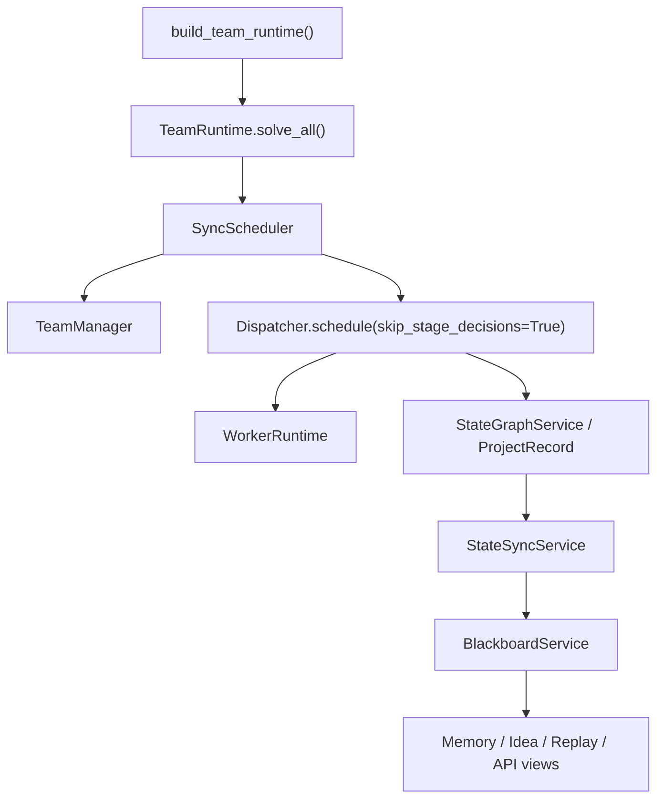
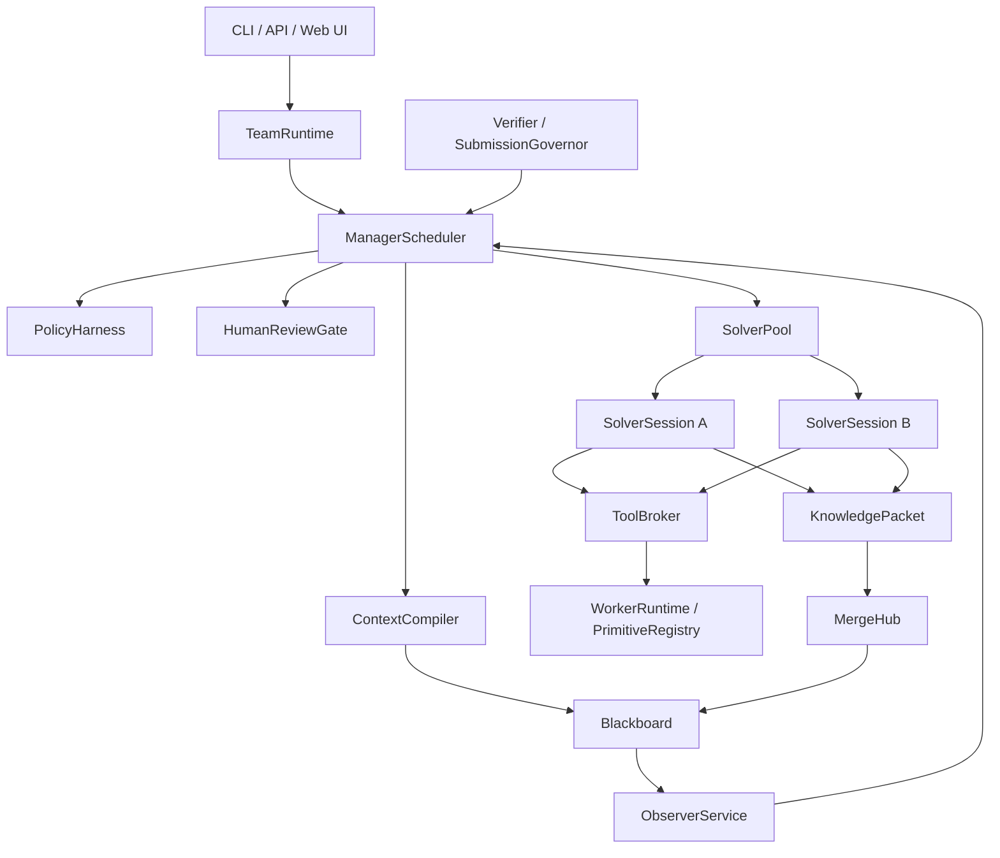

# AttackAgent Architecture

Last updated: 2026-05-14

This document is the current architecture authority. L1-L11 platform components now exist, and L11 real-path stabilization is complete. The remaining gaps are: memory must be proven as mandatory Solver input in the real path, multi-Solver collaboration must be proven end-to-end, and ToolBroker must become the sole execution path (not only retroactive journaling).

## 1. Product Direction

AttackAgent is evolving from a compact single-runtime CTF solver into a team-style solving platform:

```text
Manager        schedules, budgets, reviews, and decides
Solver         explores one assigned direction over a long-lived session
Observer       detects loops, drift, low novelty, and unsafe behavior
Verifier       checks candidate flags and critical conclusions
Human Analyst  approves high-risk or ambiguous actions
Blackboard     stores shared facts, ideas, evidence, memory, and events
MergeHub       deduplicates, arbitrates, and routes shared intelligence
PolicyHarness  enforces scope, risk, budget, and review boundaries
ToolBroker     mediates tool execution
```

The final product should expose both:

```text
CLI/API        automation, tests, batch runs
Web UI/GUI     live operation, review, intervention, replay, and audit
```

## 2. Current Reality

The current implementation is a hybrid:



Important facts:

- `TeamRuntime` is the public entry point.
- `Dispatcher` and `WorkerRuntime` still perform real solve execution.
- `StateGraphService` is still the execution-side state owner.
- `BlackboardService` is durable and queryable, but it is still partly fed by sync from `StateGraphService`.
- `ContextCompiler`, `PolicyHarness`, `HumanReviewGate`, `MergeHub`, `Observer`, and `SolverSessionManager` exist, but several are not yet proven as required participants in the real solve path.
- Multi-Solver collaboration is not complete. Default project solver count is still effectively one.
- Web UI, REST API, and SSE infrastructure exist and build. Runtime semantics are stabilized via L11.

## 3. Target Boundary

The intended runtime should become:



Final-state invariants:

- Blackboard is the team truth source.
- Manager is the only control plane.
- Manager decisions are recorded as `STRATEGY_ACTION`; worker lifecycle events represent actual worker/session state only.
- Solver sessions are long-lived roles, not isolated one-shot calls.
- Solver sharing uses structured `KnowledgePacket`, not full chat logs.
- Observer reports influence scheduling through Manager and are throttled by meaningful triggers.
- Human review can pause and resume real actions exactly once.
- Policy applies before tool/action execution and after human approval.
- ToolBroker is on the real solve execution path, not only the manual API path.
- Web UI consumes stable API/state events instead of reaching into internals.

## 4. Main Current Gaps

### 4.1 Scheduler Gap

Status: **resolved by L11**.

Manager decisions are now recorded as `STRATEGY_ACTION`. Only `SolverSessionManager` writes `WORKER_ASSIGNED`, `WORKER_HEARTBEAT`, `WORKER_TIMEOUT`, or terminal worker lifecycle events. The phantom-session bug where `LAUNCH_SOLVER` mapped to `WORKER_ASSIGNED` is fixed.

### 4.2 Memory Gap

Status: **component complete, real-path verification required**.

`SolverContextPack` carries facts, credentials, endpoints, failure boundaries, recent tool outcomes, budget constraints, scratchpad summary, and recent event IDs. `MemoryReducer` extracts structured memory from tool outcomes. The remaining requirement is to prove the real solve path feeds the next Solver turn from this structured context rather than only from legacy Dispatcher/StateGraph state.

SolverSession ownership is now complete: Manager decision events and worker lifecycle events are separated (L11 Fix 1).

### 4.3 Collaboration Gap

Status: **component complete, real collaboration pending**.

`KnowledgePacket` is the formal Solver sharing payload with types such as fact, idea, failure boundary, credential, endpoint, artifact summary, candidate flag, and help request. MergeHub validates, deduplicates, arbitrates, and routes packets. Raw logs remain evidence references, not broadcast content.

This is not yet equivalent to true multi-Solver teamwork until an end-to-end run proves that one Solver publishes a packet, MergeHub routes it, and another Solver consumes it in its next context pack.

### 4.4 Observer Gap

Status: **resolved by L11**.

Observer runs in the scheduling loop with trigger/throttle via `should_observe()`. Reports are emitted only when trigger conditions are met (N new events, consecutive failures, solver timeout, budget anomaly) or when the operator explicitly requests observation via `TeamRuntime.observe()`. No-op cycles no longer emit unlimited duplicate `OBSERVER_REPORT` events.

### 4.5 Review Gap

Status: **resolved by L11**.

`ReviewRequest` persists the proposed action payload and review decisions are journaled. Both gaps are now fixed:

- Approved `SUBMIT_FLAG` actions execute once through `_execute_approved_submit()`, which bypasses the full `submit_flag()` pipeline and does not re-enter review creation.
- `MODIFIED` decisions are rebuilt into a modified executable action payload, merged with `modified_params`, and executed through `_execute_approved_action()` with delta recording.

### 4.6 Event Semantics Gap

Status: **resolved by L11**.

All Manager decisions are recorded as `STRATEGY_ACTION`. Worker lifecycle events (`WORKER_ASSIGNED`, `WORKER_HEARTBEAT`, `WORKER_TIMEOUT`) are written only by `SolverSessionManager`. Idea, candidate flag, security validation, and knowledge packet event types are properly separated.

### 4.7 UI Gap

Status: **L10 component complete**.

React + Tailwind Web UI exists in `web/` and builds with Vite. It is served as static assets by FastAPI when `web/dist/` exists. Core views include Dashboard, Project Workspace, Graph View, Team Board, Idea Board, Memory Board, Observer Panel, Review Queue, Candidate Flag Panel, Artifact Viewer, and Replay Timeline. SSE real-time updates are wired through `useSSE` and `SSEContext`.

Some UI operations remain disabled or semantically pending: freeze/stop/launch Solver profile, mark idea valid/invalid, and direct flag approval outside the review flow.

### 4.8 L11 Runtime Stabilization

All 8 real-path issues found on 2026-05-14 have been resolved:

1. **P0 launch/session bug**: Fixed — `_record_action()` now maps all Manager decisions to `STRATEGY_ACTION`; only `SolverSessionManager` writes worker lifecycle events.
2. **P0 approved submit loop**: Fixed — `_execute_approved_submit()` bypasses the full pipeline and executes the approved submission once without re-entering review creation.
3. **P1 pause bug**: Fixed — `run_project()` merged two separate loops into one with pause check at the start of each cycle; `schedule_cycle()` also checks project status.
4. **P1 verification-state mismatch**: Fixed — `SubmissionVerifier` writes both `idea_id` and `candidate_flag_id`; `ContextCompiler` reads `candidate_flag_id` with `idea_id` fallback.
5. **P1 ToolBroker path gap**: Fixed — `ToolBroker.journal_real_execution()` writes request/policy/result events for real solve primitive executions retroactively.
6. **P1 Observer noise**: Fixed — `should_observe()` provides trigger/throttle; scheduler calls `generate_report()` only when triggers are met.
7. **P2 audit continuity gap**: Fixed — `solve_all()` uses `run_id` isolation via `BlackboardService.start_run()` instead of `clear_project_events()`.

## 5. Module Responsibility

| Module | Current Role | Target Role |
|---|---|---|
| `factory.py` | Builds `TeamRuntime` plus legacy execution dependencies | Keep public construction boundary |
| `team/runtime.py` | Main entry and integration shell | Team lifecycle kernel |
| `team/scheduler.py` | Sync scheduler wrapper | Manager action executor with policy/review/observer gates |
| `team/manager.py` | Context-aware stage decision logic | Team control-plane brain |
| `dispatcher.py` | Real stage and execution orchestration | Legacy solver runner adapter, then per-Solver executor backend |
| `runtime.py` | Primitive execution still used by Dispatcher | Tool backend behind ToolBroker after real-path migration |
| `state_graph.py` | Execution-side state | Per-solver scratchpad during migration |
| `team/blackboard.py` | Event journal/materialized state | Team truth source |
| `team/context.py` | Context compiler | Mandatory context source for Manager/Solver/Observer |
| `team/policy.py` | Action/tool policy | Unified action/tool/review/submission policy |
| `team/review.py` | Review lifecycle | Execution gate with pause/resume/modify semantics |
| `team/observer.py` | Scheduling-loop observer | Triggered observer reports consumed by Manager |
| `team/merge.py` | Knowledge packet merge and routing | Collaboration hub with packet pipeline |
| `team/tool_broker.py` | Brokered API/tool path with IOContextProvider | All real solve tool execution broker |
| `team/api.py` | REST/SSE API plus Web UI static mount | Stable product boundary for UI and automation |
| `web/` | React + Tailwind Web UI console | Operator dashboard, project workspace, review queue, replay timeline |

## 6. Implementation Doctrine

Future work should proceed by vertical migrations:

1. Clarify protocol/event semantics.
2. Make Manager consume compiled context.
3. Make Policy/Review mandatory around StrategyAction execution.
4. Make SolverSession own one continuous solving context.
5. Add KnowledgePacket and MergeHub routing.
6. Move real tool execution behind ToolBroker.
7. Add Observer to the scheduler loop with trigger/throttle semantics.
8. Build API events and Web UI after runtime semantics stabilize.
9. Do L11 stabilization before increasing multi-Solver concurrency.

Do not add broad multi-Solver concurrency until memory, idea claim, failure boundary, review, and sharing semantics are correct in the real solve path.

## 7. Verification Expectations

Architecture work must add tests that prove the real path uses the new component. Component-only tests are not enough.

Required tests:

- A Manager decision test asserts that compiled context changes the action.
- A review test asserts that an approved action resumes exactly once.
- A memory test asserts that a failure boundary prevents a repeated action.
- A collaboration test asserts that a Solver packet reaches another Solver inbox only after MergeHub.
- A policy test asserts that scheduler actions cannot execute without policy validation.
- A launch test asserts that a Manager `LAUNCH_SOLVER` decision does not create a worker session until `SolverSessionManager` creates it.
- A review-submit test asserts that approving a high-risk submit produces one real submission and no second pending review.
- A pause test asserts that `pause_project()` prevents scheduling cycles until `resume_project()`.
- A verification test asserts that evidence-chain validation updates `ManagerContext.verification_state` for the same idea/candidate id used by candidate flags.
- A ToolBroker path test asserts that the real solve path emits `tool_request` events before WorkerRuntime execution.
- An Observer test asserts that no-op cycles do not emit unlimited duplicate `OBSERVER_REPORT` events.

Manual verification:

```bash
python -m unittest discover tests/
npm.cmd --prefix web run build
python -m attack_agent team serve --port 8000
```

On PowerShell, prefer `npm.cmd` if script execution policy blocks `npm.ps1`.
