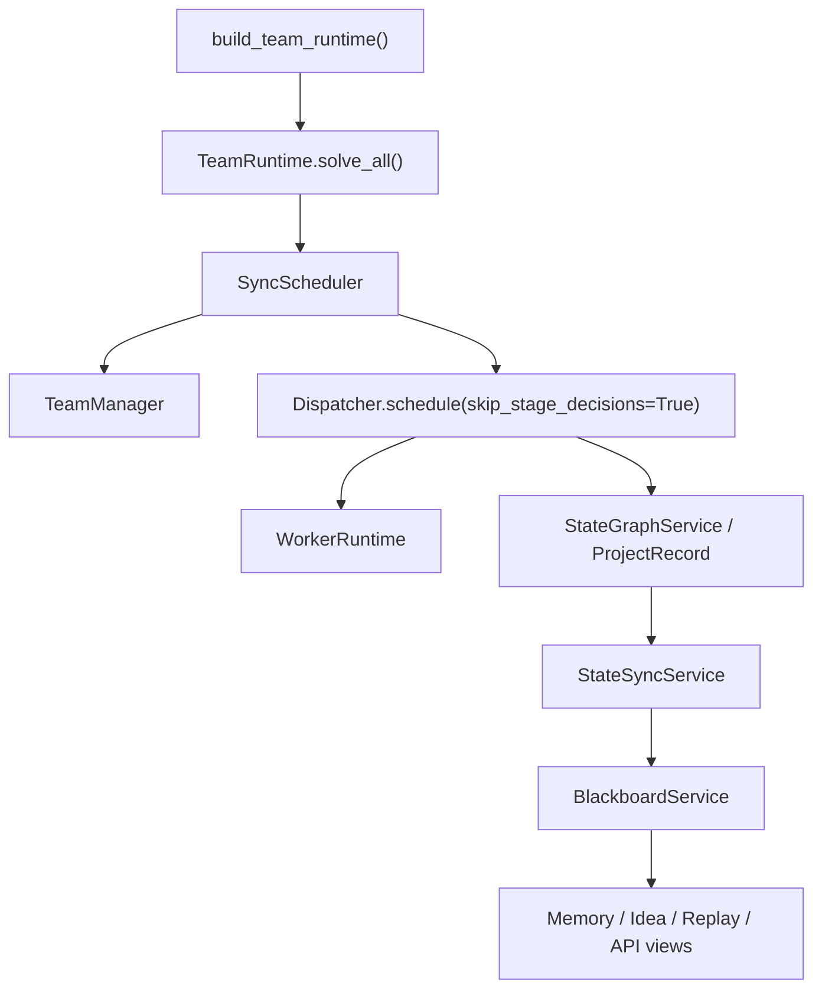
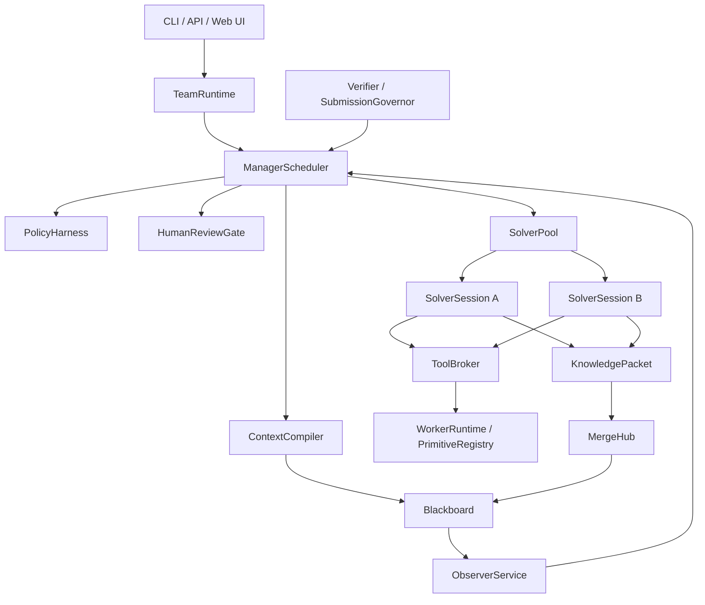

# AttackAgent Architecture

Last updated: 2026-05-12

This document is the current architecture authority. It separates current implementation reality from the target team-runtime design so future agents do not mistake scaffolding for completed architecture.

## 1. Product Direction

AttackAgent is evolving from a compact single-runtime CTF solver into a team-style solving platform:

```text
Manager        schedules, budgets, reviews, and decides
Solver         explores one assigned direction over a long-lived session
Observer       detects loops, drift, low novelty, and unsafe behavior
Verifier       checks candidate flags and critical conclusions
Human Analyst  approves high-risk or ambiguous actions
Blackboard     stores shared facts, ideas, evidence, memory, and events
MergeHub       deduplicates, arbitrates, and routes shared intelligence
PolicyHarness  enforces scope, risk, budget, and review boundaries
ToolBroker     mediates tool execution
```

The final product should expose both:

```text
CLI/API        automation, tests, batch runs
Web UI/GUI     live operation, review, intervention, replay, and audit
```

## 2. Current Reality

The current implementation is a hybrid:



Important facts:

- `TeamRuntime` is the public entry point.
- `Dispatcher` and `WorkerRuntime` still perform real solve execution.
- `StateGraphService` is still the execution-side state owner.
- `BlackboardService` is durable and queryable, but it is still partly fed by sync from `StateGraphService`.
- `ContextCompiler`, `PolicyHarness`, `HumanReviewGate`, `MergeHub`, `Observer`, and `SolverSessionManager` exist, but several are not yet required participants in every solve cycle.
- Multi-Solver collaboration is not complete. Default project solver count is still effectively one.

## 3. Target Boundary

The intended runtime should become:



Final-state invariants:

- Blackboard is the team truth source.
- Manager is the only control plane.
- Solver sessions are long-lived roles, not isolated one-shot calls.
- Solver sharing uses structured `KnowledgePacket`, not full chat logs.
- Observer reports influence scheduling through Manager.
- Human review can pause and resume real actions.
- Policy applies before and after human approval.
- Web UI consumes stable API/state events instead of reaching into internals.

## 4. Main Current Gaps

### 4.1 Scheduler Gap

Current scheduler behavior is still stage-wrapper oriented. `TeamManager` returns simple `StrategyAction`s, then `SyncScheduler` calls legacy execution. It does not yet compile and consume a complete `ManagerContext` containing solver states, ideas, memory, observer reports, review decisions, resource status, and policy constraints.

Required direction:

- Make `ContextCompiler.compile_manager_context()` mandatory before every Manager decision.
- Route every `StrategyAction` through `PolicyHarness`.
- Make review-required actions pause and resume through `HumanReviewGate`.
- Treat observer reports as scheduling inputs.

### 4.2 Memory Gap

Status: **L4 resolved** — SolverContextPack now carries facts, credentials, endpoints, failure boundaries, recent tool outcomes, budget constraints, scratchpad summary, and recent event IDs. MemoryReducer extracts structured memory from tool outcomes. `is_boundary_repetition` prevents immediate repetition of failed approaches. All lists bounded by SOLVER_CONTEXT_LIMITS.

Remaining gap: SolverContextPack is compiled in the production scheduling path (after `_execute_solver_cycle`), but SolverSession does not yet have full long-lived ownership (L5). Inbox remains empty until L6 (KnowledgePacket).

### 4.3 Collaboration Gap

There is no formal `KnowledgePacket` protocol. `MergeHub` can dedupe facts/ideas and arbitrate candidates, but Solver-to-Solver intelligence flow is not yet the main collaboration path.

Required direction:

- Add `KnowledgePacket` as the only Solver sharing payload.
- Route packets through `MergeHub` before they become global facts or inbox messages.
- Keep raw logs as evidence references, not broadcast content.

### 4.4 Observer Gap

Observer is currently an on-demand analyzer. It writes advisory checkpoint events, but Scheduler does not automatically consume them.

Required direction:

- Run Observer periodically or when a Solver crosses drift/stagnation thresholds.
- Convert reports into Manager-visible recommendations.
- Escalate stop/reassign/scope/submit recommendations through policy and review.

### 4.5 Review Gap

HumanReviewGate can create and resolve requests, but review decisions are not yet first-class execution leases. Some submit paths also rebuild policy actions with lower risk than the Manager originally requested.

Required direction:

- Persist paused action payloads inside `ReviewRequest`.
- On approval, resume the exact approved action or approved modified action.
- On rejection, write a `FailureBoundary` or policy memory entry.
- Candidate flag submission must always pass SubmissionGovernor and review policy.

### 4.6 Event Semantics Gap

Current code reuses `candidate_flag` events for real candidate flags, idea lifecycle events, and convergence actions. This makes status, merge, and submit logic ambiguous.

Required direction:

- Introduce or simulate distinct event names:
  - `idea_proposed`, `idea_claimed`, `idea_verified`, `idea_failed`
  - `candidate_flag_found`, `candidate_flag_verified`
  - `strategy_action_recorded`
  - `review_created`, `review_decided`
  - `knowledge_packet_published`, `knowledge_packet_merged`
- Keep compatibility adapters while moving new code to the clearer semantics.

### 4.7 UI Gap

The repository has CLI and FastAPI endpoints. It does not yet have the intended Web UI/GUI console.

Required direction:

- Stabilize API semantics first.
- Add SSE/WebSocket event stream.
- Build Web UI around dashboard, project workspace, team board, idea board, memory board, review queue, candidate flag panel, artifact viewer, and replay timeline.

## 5. Module Responsibility

| Module | Current Role | Target Role |
|---|---|---|
| `factory.py` | Builds `TeamRuntime` plus legacy execution dependencies | Keep public construction boundary |
| `team/runtime.py` | Main entry and integration shell | Team lifecycle kernel |
| `team/scheduler.py` | Sync scheduler wrapper | Manager action executor with policy/review/observer gates |
| `team/manager.py` | Simple stage decision logic | Team control-plane brain |
| `dispatcher.py` | Real stage and execution orchestration | Legacy solver runner adapter, then per-Solver executor backend |
| `runtime.py` | Primitive execution | Tool backend behind ToolBroker |
| `state_graph.py` | Execution state | Per-solver scratchpad during migration |
| `team/blackboard.py` | Event journal/materialized state | Team truth source |
| `team/context.py` | Context compiler exists | Mandatory context source for Manager/Solver/Observer |
| `team/policy.py` | Partial action policy | Unified action/tool/review/submission policy |
| `team/review.py` | Review lifecycle | Execution gate with pause/resume |
| `team/observer.py` | Manual advisory analyzer | Sidecar reviewer feeding Manager |
| `team/merge.py` | Dedup/arbitration helpers | Knowledge merge and route hub |
| `team/tool_broker.py` | IO-free primitive broker | All tool execution broker |

## 6. Implementation Doctrine

Future work should proceed by vertical migrations:

1. Clarify protocol/event semantics.
2. Make Manager consume compiled context.
3. Make Policy/Review mandatory around StrategyAction execution.
4. Make SolverSession own one continuous solving context.
5. Add KnowledgePacket and MergeHub routing.
6. Move real tool execution behind ToolBroker.
7. Add Observer to the scheduler loop.
8. Build API events and Web UI after runtime semantics stabilize.

Do not add broad multi-Solver concurrency until memory, idea claim, failure boundary, and sharing semantics are correct.

## 7. Verification Expectations

Architecture work should add tests that prove the real path uses the new component. Component-only tests are not enough.

Examples:

- A Manager decision test should assert that compiled context changes the action.
- A review test should assert that an approved action resumes exactly once.
- A memory test should assert that a failure boundary prevents a repeated action.
- A collaboration test should assert that a Solver packet reaches another Solver inbox only after MergeHub.
- A policy test should assert that scheduler actions cannot execute without policy validation.
