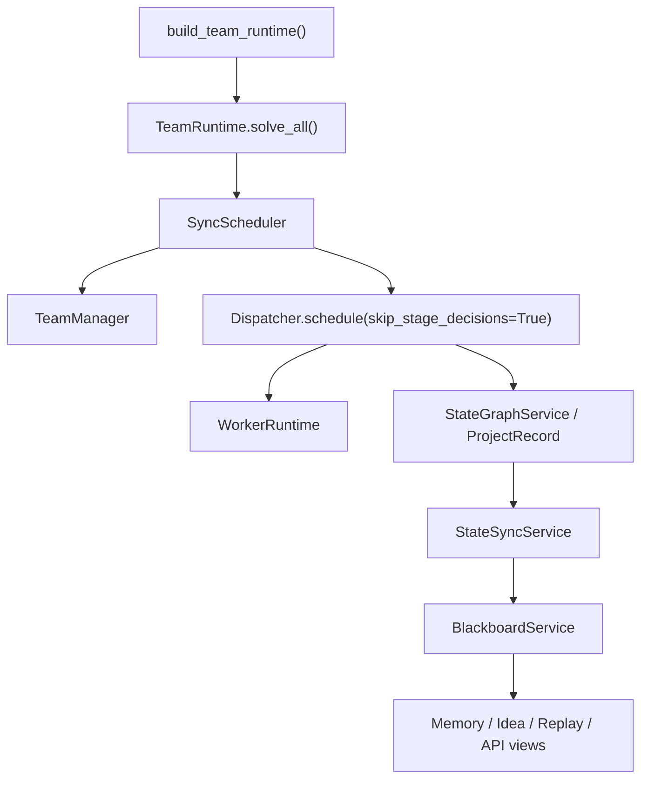
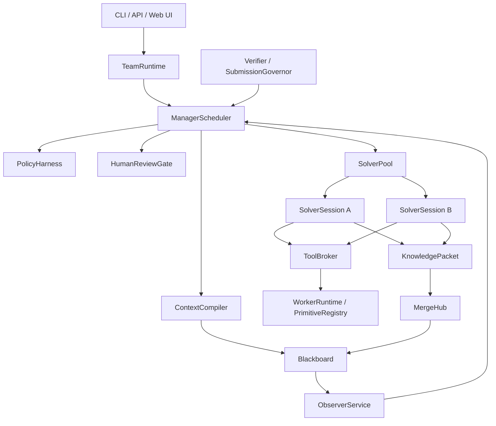

# AttackAgent Architecture

Last updated: 2026-05-12

This document is the current architecture authority. It separates current implementation reality from the target team-runtime design so future agents do not mistake scaffolding for completed architecture.

## 1. Product Direction

AttackAgent is evolving from a compact single-runtime CTF solver into a team-style solving platform:

```text
Manager        schedules, budgets, reviews, and decides
Solver         explores one assigned direction over a long-lived session
Observer       detects loops, drift, low novelty, and unsafe behavior
Verifier       checks candidate flags and critical conclusions
Human Analyst  approves high-risk or ambiguous actions
Blackboard     stores shared facts, ideas, evidence, memory, and events
MergeHub       deduplicates, arbitrates, and routes shared intelligence
PolicyHarness  enforces scope, risk, budget, and review boundaries
ToolBroker     mediates tool execution
```

The final product should expose both:

```text
CLI/API        automation, tests, batch runs
Web UI/GUI     live operation, review, intervention, replay, and audit
```

## 2. Current Reality

The current implementation is a hybrid:



Important facts:

- `TeamRuntime` is the public entry point.
- `Dispatcher` and `WorkerRuntime` still perform real solve execution.
- `StateGraphService` is still the execution-side state owner.
- `BlackboardService` is durable and queryable, but it is still partly fed by sync from `StateGraphService`.
- `ContextCompiler`, `PolicyHarness`, `HumanReviewGate`, `MergeHub`, `Observer`, and `SolverSessionManager` exist, but several are not yet required participants in every solve cycle.
- Multi-Solver collaboration is not complete. Default project solver count is still effectively one.

## 3. Target Boundary

The intended runtime should become:



Final-state invariants:

- Blackboard is the team truth source.
- Manager is the only control plane.
- Solver sessions are long-lived roles, not isolated one-shot calls.
- Solver sharing uses structured `KnowledgePacket`, not full chat logs.
- Observer reports influence scheduling through Manager.
- Human review can pause and resume real actions.
- Policy applies before and after human approval.
- Web UI consumes stable API/state events instead of reaching into internals.

## 4. Main Current Gaps

### 4.1 Scheduler Gap

Current scheduler behavior is still stage-wrapper oriented. `TeamManager` returns simple `StrategyAction`s, then `SyncScheduler` calls legacy execution. It does not yet compile and consume a complete `ManagerContext` containing solver states, ideas, memory, observer reports, review decisions, resource status, and policy constraints.

Required direction:

- Make `ContextCompiler.compile_manager_context()` mandatory before every Manager decision.
- Route every `StrategyAction` through `PolicyHarness`.
- Make review-required actions pause and resume through `HumanReviewGate`.
- Treat observer reports as scheduling inputs.

### 4.2 Memory Gap

Status: **L4 resolved** — SolverContextPack now carries facts, credentials, endpoints, failure boundaries, recent tool outcomes, budget constraints, scratchpad summary, and recent event IDs. MemoryReducer extracts structured memory from tool outcomes. `is_boundary_repetition` prevents immediate repetition of failed approaches. All lists bounded by SOLVER_CONTEXT_LIMITS.

**L5 resolved** — SolverSession now has real long-lived ownership. Sessions are created/claimed/started before execution via SolverSessionManager in the scheduling path. Outcome events include solver_id. Idea leases are exclusive. L4 field updates use WORKER_HEARTBEAT events instead of WORKER_ASSIGNED to avoid state machine conflicts.

**L6 resolved** — SolverContextPack.inbox is now populated from routed/targeted KnowledgePackets. MergeHub validates, dedupes, arbitrates, and routes packets. Global accepted packets update Blackboard (OBSERVATION/CANDIDATE_FLAG events). Targeted packets enter Solver inbox via KNOWLEDGE_PACKET_MERGED events. Conflicting facts produce merge decisions visible in Blackboard. Help requests route to solver profiles.

### 4.3 Collaboration Gap

Status: **L6 resolved** — KnowledgePacket is the formal Solver sharing payload with types (fact, idea, failure_boundary, credential, endpoint, artifact_summary, candidate_flag, help_request), source solver, confidence, evidence refs, routing priority, and suggested recipients. MergeHub validates, dedupes, arbitrates, and routes packets through the full pipeline. Global accepted packets update Blackboard as OBSERVATION/CANDIDATE_FLAG/ACTION_OUTCOME events. Targeted packets enter Solver inbox via KNOWLEDGE_PACKET_MERGED events. Raw logs remain evidence references, not broadcast content.

### 4.4 Observer Gap

Status: **L7 resolved** — Observer is a mandatory scheduling-loop participant.
`Observer.generate_report()` writes `OBSERVER_REPORT` events (not CHECKPOINT).
`ContextCompiler` reconstructs full `ObservationReport` data including observations,
intervention_level, and recommended_action. `TeamManager.decide_observer_response()`
produces scheduling actions (steer/throttle/stop/reassign) based on intervention level.
PolicyHarness allows observer safety-block actions through as needs_review instead of deny.
Observer never directly mutates facts or stops a Solver.

### 4.5 Review Gap

HumanReviewGate can create and resolve requests, but review decisions are not yet first-class execution leases. Some submit paths also rebuild policy actions with lower risk than the Manager originally requested.

Required direction:

- Persist paused action payloads inside `ReviewRequest`.
- On approval, resume the exact approved action or approved modified action.
- On rejection, write a `FailureBoundary` or policy memory entry.
- Candidate flag submission must always pass SubmissionGovernor and review policy.

### 4.6 Event Semantics Gap

Current code reuses `candidate_flag` events for real candidate flags, idea lifecycle events, and convergence actions. This makes status, merge, and submit logic ambiguous.

Required direction:

- Introduce or simulate distinct event names:
  - `idea_proposed`, `idea_claimed`, `idea_verified`, `idea_failed`
  - `candidate_flag_found`, `candidate_flag_verified`
  - `strategy_action_recorded`
  - `review_created`, `review_decided`
  - `knowledge_packet_published`, `knowledge_packet_merged`
- Keep compatibility adapters while moving new code to the clearer semantics.

### 4.7 UI Gap

Status: **L10 in progress** — React + Tailwind Web UI built in `web/` directory with Vite toolchain. Served as static assets by FastAPI via `StaticFiles(html=True)` mount (guarded by `web/dist/` existence check). All 11 core views implemented: Dashboard, Project Workspace, Graph View, Team Board, Idea Board, Memory Board, Observer Panel, Review Queue, Candidate Flag Panel, Artifact Viewer, Replay Timeline. SSE real-time updates via `useSSE` hook + `SSEContext` provider. Human operations implemented: start/pause/resume project, approve/reject review, add hint. Solver freeze/stop/launch actions show as disabled (API endpoints pending). Dev workflow: Vite dev server proxies `/api` to FastAPI; production uses single port 8000 serving both API and static UI.

## 5. Module Responsibility

| Module | Current Role | Target Role |
|---|---|---|
| `factory.py` | Builds `TeamRuntime` plus legacy execution dependencies | Keep public construction boundary |
| `team/runtime.py` | Main entry and integration shell | Team lifecycle kernel |
| `team/scheduler.py` | Sync scheduler wrapper | Manager action executor with policy/review/observer gates |
| `team/manager.py` | Simple stage decision logic | Team control-plane brain |
| `dispatcher.py` | Real stage and execution orchestration | Legacy solver runner adapter, then per-Solver executor backend |
| `runtime.py` | Primitive execution | Tool backend behind ToolBroker |
| `state_graph.py` | Execution state | Per-solver scratchpad during migration |
| `team/blackboard.py` | Event journal/materialized state | Team truth source |
| `team/context.py` | Context compiler exists | Mandatory context source for Manager/Solver/Observer |
| `team/policy.py` | Partial action policy | Unified action/tool/review/submission policy |
| `team/review.py` | Review lifecycle | Execution gate with pause/resume |
| `team/observer.py` | Mandatory scheduling-loop participant | Produces intervention-level reports consumed by Manager — L7 integrated |
| `team/merge.py` | Dedup/arbitration helpers | Knowledge merge and route hub with packet pipeline (validate→dedup→arbitrate→route) |
| `team/tool_broker.py` | All tool execution broker with IOContextProvider | All tool execution broker — policy gate + event journal for all primitives |
| `team/api.py` | Read-only + review governance REST endpoints + StaticFiles mount for Web UI | Full REST + SSE event stream + project lifecycle + Web UI static asset serving — Blackboard-only data source |
| `web/` | React + Tailwind Web UI console (Vite build → `web/dist/`) | 11 views consuming L9 API + SSE stream only — operator dashboard, project workspace, review queue, replay timeline |

## 6. Implementation Doctrine

Future work should proceed by vertical migrations:

1. Clarify protocol/event semantics.
2. Make Manager consume compiled context.
3. Make Policy/Review mandatory around StrategyAction execution.
4. Make SolverSession own one continuous solving context.
5. Add KnowledgePacket and MergeHub routing.
6. Move real tool execution behind ToolBroker.
7. Add Observer to the scheduler loop.
8. Build API events and Web UI after runtime semantics stabilize.

Do not add broad multi-Solver concurrency until memory, idea claim, failure boundary, and sharing semantics are correct.

## 7. Verification Expectations

Architecture work should add tests that prove the real path uses the new component. Component-only tests are not enough.

Examples:

- A Manager decision test should assert that compiled context changes the action.
- A review test should assert that an approved action resumes exactly once.
- A memory test should assert that a failure boundary prevents a repeated action.
- A collaboration test should assert that a Solver packet reaches another Solver inbox only after MergeHub.
- A policy test should assert that scheduler actions cannot execute without policy validation.
